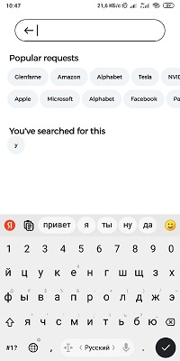

## Stocks

Это приложение для просмотра информации об акциях.

### Главная страница

На стартовой странице приложения находится список акций, 
отсортированный по популярности.
Цены акций обновляются в режиме реального времени через веб-сокеты.

### Поиск

Есть возможность искать необходимые акции по названию компании 
или тикеру. В приложении сохраняется историю поисковых запросов,
а также предлагаются самые популярные поисковые запросы.
Список результатов обновляется после каждой введенной буквы.

### Избранное

Есть возможность добавлять акции в избранное и просматривать их на специальной странице.
Навигация между главной страницей и избранных выполняется свайпом или тапом на таб.

### Карточка акции

На карточке также цена обновляется в реальном времени.

График имеет несколько временных периодов -- все время, год, полгода, месяц, неделя и день.
Можно узнать цену акции в любой период имеющийся на графике.

 

Также в карточке акции можно просмотреть подробную информацию о компании.

 

В карточке акции есть список актуальных новостей связанных с компанией.

### Технологии 

При создании проекта были использованы следующие технологии и подходы:

* Kotlin
* Android SDK
* Google Architecture Components
* MVVM Architecture
* Room
* SQLite
* Gson
* ViewPager2
* MPAndroidChart
* Picasso
* okhttp
* Kotlin Coroutines
* Websockets

